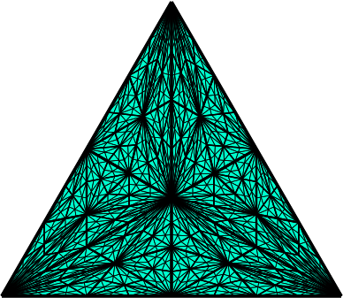

  

<h1 align="center">AdjointAntics</h1>

<em>When left meets right, code gets dual-wielded</em>

---

**Definition.** Let **CT** be the category of categorical structures and **AI** be the category of intelligent systems. *AdjointAntics* is the free functor

    F : CT ⇄ AI

mapping abstract nonsense to concrete excellence.

**Axioms:**
- Every diagram should commute
- Every abstraction should compute
- Every contributor is welcome

## Focus

| Domain | Objects |
|:--|:--|
| **Category Theory** | Adjunctions, comonads, Yoneda embeddings, universal constructions |
| **AI & Learning** | Categorical foundations for neural architectures, compositional reasoning |
| **Julia** | Type-driven libraries where the algebra compiles |

## Contribute

We welcome morphisms from all categories. If you think in diagrams and dream in functors — open an issue, submit a PR, or just star something that commutes.

---

<em>Seeking the universal property of good software.</em>

